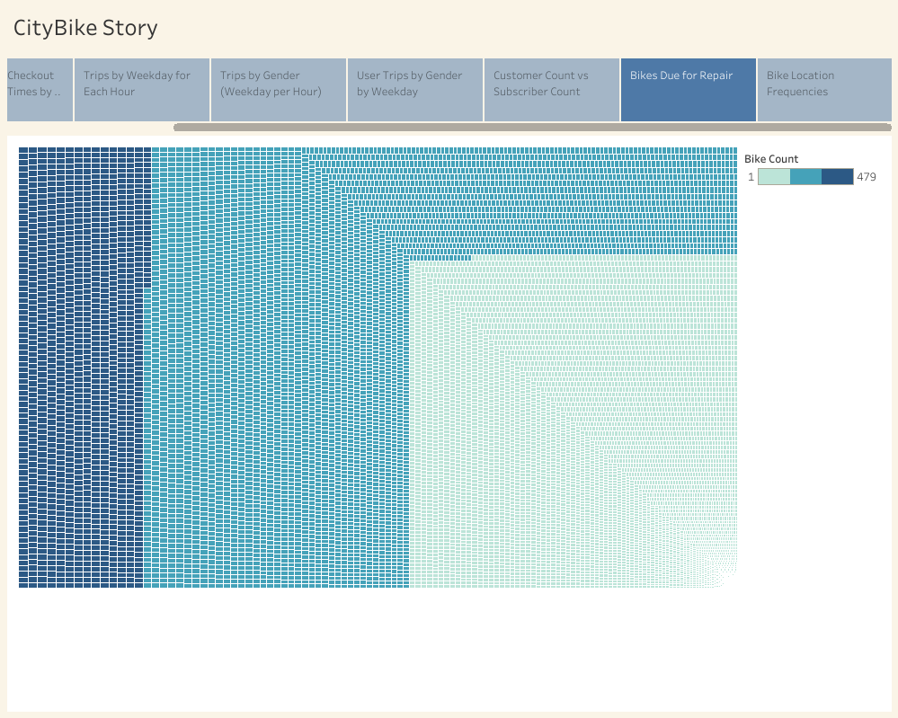

# [CityBike Analysis](https://public.tableau.com/shared/QDRRKFQ78?:display_count=n&:origin=viz_share_link)

In your README markdown file, include the following:

## Overview
The purpose of this analysis is to demonstrate data visualizations created with Tableau.

The visualizations represent data extracted from NY City Bike; a successful bike sharing company. The Manhattan City Bike Rental data analysis has been requested for reference to determine if a similar operation in Des Moines, Iowa might be worthwhile.

## Results:

### [Checkout Times for Users](https://public.tableau.com/shared/3SHCW28QH?:display_count=n&:origin=viz_share_link)

The visualization above shows us that the majority of bike rental duration is less than 25 minutes; peaking at 5 minutes. This is most likley due to the natural boundaries of the island.

### [Checkout Times by Gender](https://public.tableau.com/shared/SXWK273FS?:display_count=n&:origin=viz_share_link)

This visualization takes the same minutes of trip duration shown above but breaks it down by gender. We can see that nearly 3 and half times more male riders than female riders are renting. However the slope for are rental times by remains the same.

### [Trips by Weekday for Each Hour](https://public.tableau.com/shared/D7RD7Q9TC?:display_count=n&:origin=viz_share_link)

This heatmap shows that that there are two peak times of rentals during the workweek. The red areas are consistent with rush hours in morning and evening as well as happy hour. 

### [Trips by Gender (Weekday per Hour)](https://public.tableau.com/shared/RF3TQ6GT7?:display_count=n&:origin=viz_share_link)

This heat map is a breakdown of the rentals by hour for each day of the week separated by gender. The trend shows that peak hours of demand are mostly our male riders.

### [User Trips by Gender by Weekday](https://public.tableau.com/shared/RP48RCSFJ?:display_count=n&:origin=viz_share_link)

This map indicates that of all the renals data analyzed there are more rentals by the monthly subscribers than non subscribers. It is important to consider that a high volume of rentals are rentals by the person. For a better understanding of revenue we should look our volume of monthly subscribers instead of volume of rentals.   

### [Customers vs Subscribers](https://public.tableau.com/views/CityBike_16367531669280/CityBikeStory?:language=en-US&publish=yes&:display_count=n&:origin=viz_share_link)

This pie chart answers the question the last visualization raises. 81% of the 2,344,224 rental are from the subscribing customers. One might conclude that remaining 19% are from tourists.  

## Summary:

Based upon the data so far we can see the island of Manahattan has key geographic features that are not found in Des Moines. The success of CityBike in NY can also be attributed to the large population of 1.63 million. The population of Des Moines is only 214,000; even less people would be considered qualified customers since the target areas for bike sharing will be more urban instead the suburbs. Since the volume of bike rentals is relative to the population size of  an area it is recommended that more analysis is needed of Des Moines as a prospect. Moreover, identifying those metrics will offer the use of other valuable data analyses from NY CityBike to be considered. 

For Instance

### [Bikes Due for Repair](https://public.tableau.com/shared/73WNZHGHW?:display_count=n&:origin=viz_share_link)

With a fleet of 13,983 bikes 1138 are currently due for repair in New York. That is about a twelth of the fleet at any time (given proper preventavtive maintenance rotation. 

### [Area Spread](https://public.tableau.com/shared/MXX2R3BJ8?:display_count=n&:origin=viz_share_link)

52 are outliers with less than and average of less than 1.5 instances per outlier.
This map shows us the area that the total rental activity covers. The natural boundary of the waterways around the island keep the bikes well confined to an area of nearly 23 square miles. The 52 markers outside of the island are outliers with an average of less than 1.5 instances per outlier. The markers to the North indicate there is a niche to be filled in the area and while cost of operations increase with a larger area then this neighborhood can be considered sustainable while the markers the West of the island would be an expense hard to manage. The possibilty of more expensive outliers in a city like Des Moines might be greater since there are less natural boundaries.

Proper Due Diligence with such a proposal requires that financial metrics be analyzed. The cost per unit as well as profits earned per unit would help better estitmate venture capital and capex dollars needed to start. Other financial data would be helpful to establish operating expenses such as taxes and payroll; offering a more complete picture of what investors wants to know most, the ROIs and NIOs. 

## [NY CITYBIKE](https://public.tableau.com/shared/QDRRKFQ78?:display_count=n&:origin=viz_share_link)

